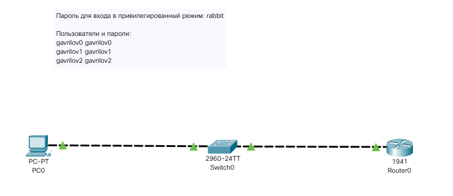
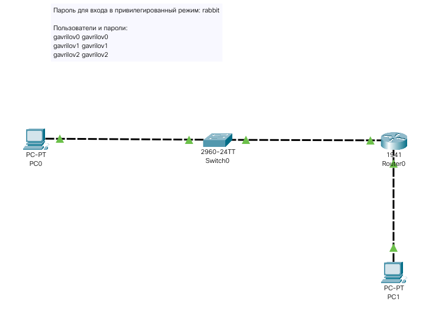
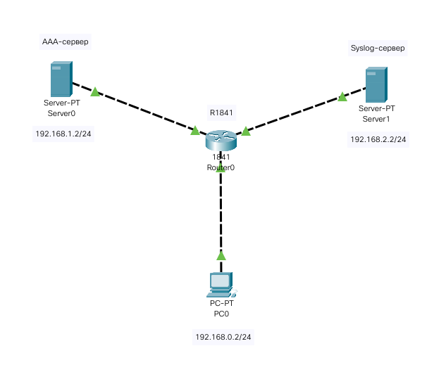
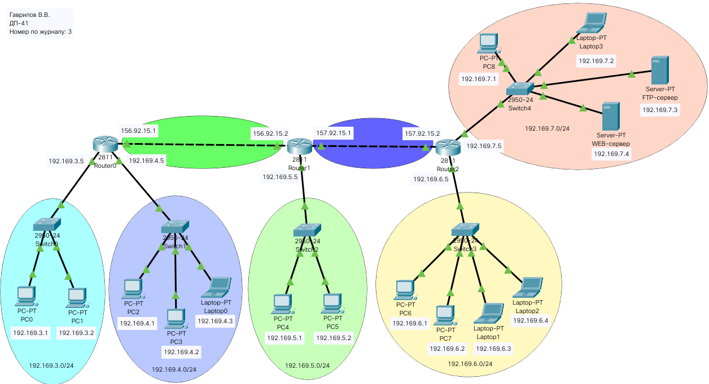
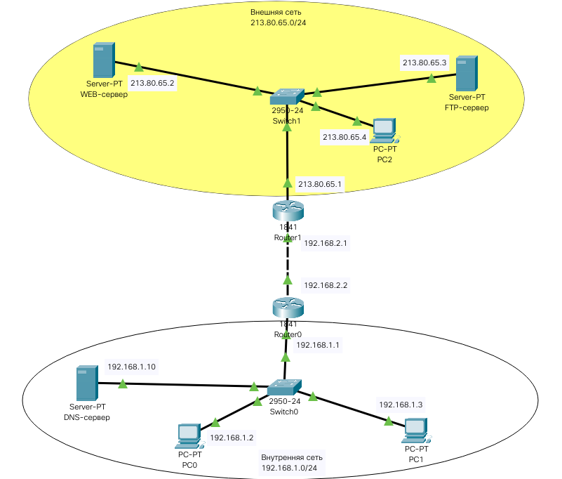
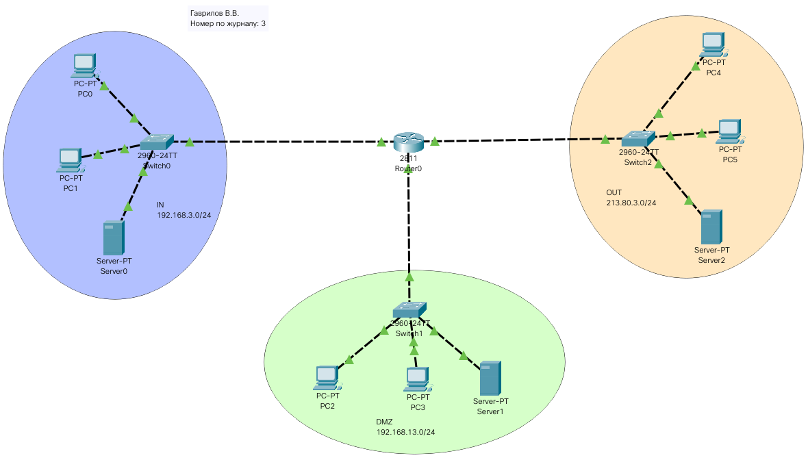
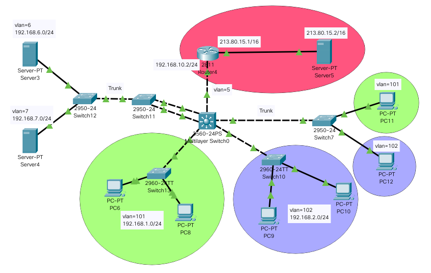
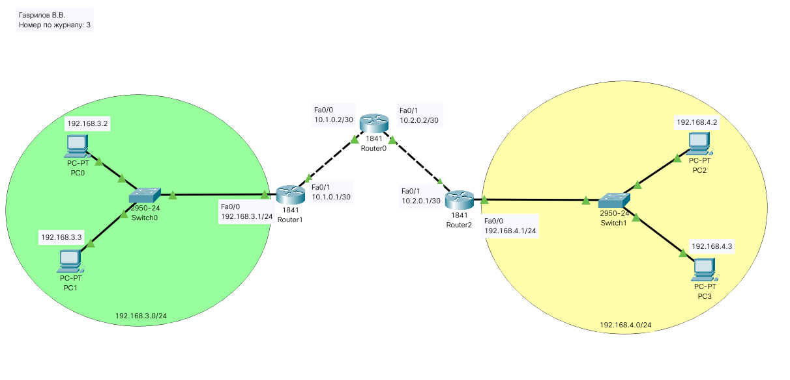

# Лабораторные работы в Cisco Packet Tracer

## Лабораторная работа №2_4_1

**Задание:**
Используя программные продукты (Cisco Packet Tracer или GNS3) или реальное оборудование, подключиться к консольному порту устройства (коммутатора или маршрутизатора). Создать пароль для входа в привилегированный режим, используя параметр secret. Создать три учетные записи с разными уровнями привилегий, используя функцию ААА. При создании учетных записей использовать логин <фамилия в английской транскрипции№учетной записи>. Проверить работоспособность системы аутентификации по локальной базе пользователей.

**Сеть:**
IP-адрес PC0: 192.168.1.2 255.255.255.0

```text
!Router0:
enable
    configure terminal
        interface gigabitEthernet 0/0 
            no shutdown
            ip address 192.168.1.1 255.255.255.0
            exit
        exit
    write memory
    exit
```

**Решение:**

```text
!PC0:
enable
    configure terminal
        enable secret rabbit
        exit
    write memory
    exit


!Router0:
enable
    configure terminal
        enable secret rabbit

        username gavrilov0 privilege 1 secret gavrilov0
        username gavrilov1 privilege 8 secret gavrilov1
        privilege exec level 8 ping
        privilege exec level 8 dir
        privilege exec level 8 clock
        username gavrilov2 privilege 15 secret gavrilov2

        !line console 0
            !login local
            !exit

        aaa new-model
        aaa authentication login default local
        exit
    write memory
    exit
```



## Лабораторная работа №2_4_2

**Задание:**
Подключить к одному из Etrhernet-портов маршрутизатора рабочую станцию, произведя необходимые настройки (IP-адреса порта маршрутизатора и рабочей станции). Осуществить удаленное подключение к маршрутизатору с использованием протокола Telnet. Проверить работоспособность системы аутентификации.

**Решение:**
Добавил PC1 и порт маршрутизатора в отдельную подсеть 192.168.100.0/24.
Присвоил PC1 адрес 192.168.100.2, а Gig0/1 192.168.100.1.

```text
!Router0:
enable
    configure terminal
        interface Gig0/1
            no shutdown
            ip address 192.168.100.1 255.255.255.0
            exit
        exit
    write memory
    exit
```

Проверил наличие telnet-соединения командой:
telnet 192.168.100.1


## Лабораторная работа №2_4_3

**Задание:**
Сконфигурировать маршрутизатор для работы с протоколом SSH, исключив возможность использования протокола Telnet. Используя SSH-клиент, осуществить удаленное подключение к маршрутизатору с использованием протокола SSH. Проверить работоспособность системы аутентификации.

**Решение:**

```text
!R0:
enable
    configure terminal
        hostname R0

        ip domain-name mydomain.ru
        crypto key generate rsa

        line vty 0 15
            transport input ssh
            exit
        
        !aaa new-model
        !aaa authentication login default local

        exit
    write memory
    exit
```



## Лабораторная работа №3_5

**Задание:**

1. Используя Cisco Packet Tracer или GNS3, собрать схему
фрагмента сети. Настроить IP-адресацию,
обеспечив доступность сервера с управляющего ПК.
2. Сконфигурировать маршрутизатор для работы совместно с ААА-
и Syslog-серверами.
3. Настроить аутентификацию и авторизацию двух пользователей с
различными правами, используя протокол TACACS+.
4. Убедиться в работоспособности системы аутентификации и
логирования событий входа-выхода.

**Решение:**

Указал IP-адреса, маску подсети и шлюз по умолчанию для всех устройств в сети. Установил в маршрутизатор доп. модуль и настроил все интерфейсы маршрутизатора.

В графическом интерфейсе включаем AAA-сервер, создаем клиента
с именем "R1841" (в данном случае это роутер 192.168.1.1) и паролем "aaa_pass".

Там же создаем две учетные записи пользователей:
aaa_admin с паролем "aaa_admin"
aaa_user с паролем "aaa_user".

```text
!Router0:
enable
    configure terminal
        !Создание локальной учетной записи
        username local_admin privilege 15 secret local_pass
        enable secret carrot

        !Настройка работы маршрутизатора с AAA-сервером
        aaa new-model
        tacacs-server host 192.168.1.2
        tacacs-server key aaa_pass
        aaa authentication login default group tacacs+ local

        !Настройка учета (accounting)
        aaa accounting exec default start-stop group tacacs+

        !Настройка логирования посредством Syslog-сервера
        logging on
        logging host 192.168.2.2
        logging trap debugging

        !Настройка времени
        ntp server 192.168.2.2
        clock timezone MSK 4
        service timestamps log datetime msec

        exit
    write memory
    exit
```

Проверяем работоспособность системы с подключенным AAA-сервером и отлюченным. В первом случае логин и пароль от локальной учетной записи не дадут войти в систему. Доступ будет возможен только посредством тех учетных записей, которые были созданы на AAA-сервере. Во втором случае наоборот: учетные записи AAA-сервера не дадут войти в систему, а локальная учетная запись даст.



## Лабораторная работа №4_5_1

**Задание:**

1. Всем компьютерам подсети 192.169.3.0 предоставить полный доступ ко всем серверам.
2. Всем компьютерам подсети 192.169.4.0 предоставить доступ только к FTP-серверу по протоколу FTP.
3. Всем компьютерам подсети 192.169.5.0 предоставить доступ только к WEB-серверу.
4. Компьютерам оставшейся подсети запретить доступ к внешним ресурсам.

**Сеть:**
Настройка сегментов сети:

```text
!Настройка Router0:
enable
    configure terminal
        interface FastEthernet 0/1
            no shutdown
            ip address 192.169.3.5 255.255.255.0
            exit
        interface FastEthernet 1/0
            no shutdown
            ip address 192.169.4.5 255.255.255.0
            exit
        exit
    write memory
    exit

!Настройка Router1:
enable
    configure terminal
        interface FastEthernet 1/0
            no shutdown
            ip address 192.169.5.5 255.255.255.0
            exit
        exit
    write memory
    exit

!Настройка Router2:
enable
    configure terminal
        interface FastEthernet 0/1
            no shutdown
            ip address 192.169.6.5 255.255.255.0
            exit
        interface FastEthernet 1/0
            no shutdown
            ip address 192.169.7.5 255.255.255.0
            exit
        exit
    write memory
    exit
```

Настроил IP-адреса для PC0-PC9 согласно заданию, а также сконфигурировал WEB- и FTP-серверы.
Добавил в Default Gateway IP-адрес порта маршрутизатора для каждой из подсетей.

Настройка двух сетей между маршрутизаторами:

```text
!Настройка Router0:
enable
    configure terminal
        interface FastEthernet 0/0
            no shutdown
            ip address 156.92.15.1 255.255.255.252
            exit
        exit
    write memory
    exit

!Настройка Router1:
enable
    configure terminal
        interface FastEthernet 0/0
            no shutdown
            ip address 156.92.15.2 255.255.255.252
            exit
        interface FastEthernet 0/1
            no shutdown
            ip address 157.92.15.1 255.255.255.252
            exit
        exit
    write memory
    exit

!Настройка Router2:
enable
    configure terminal
        interface FastEthernet 0/0
            no shutdown
            ip address 157.92.15.2 255.255.255.252
            exit
        exit
    write memory
    exit
```

После этого между маршрутизаторами появится связь. Но маршрутизации между подсетями пока нет.

Настройка статической маршрутизации.
Указываю на маршрутизаторах Router0 и Router2 маршруты по умолчанию:

```text
!Настройка Router0:
enable
    configure terminal
        interface FastEthernet 0/0
            ip route 0.0.0.0 0.0.0.0 156.92.15.2
            exit
        exit
    write memory
    exit

!Настройка Router2:
enable
    configure terminal
        interface FastEthernet 0/0
            ip route 0.0.0.0 0.0.0.0 157.92.15.1
            exit
        exit
    write memory
    exit
```

На маршрутизаторе Router1 указываю таблицу маршрутизации:

```text
!Настройка Router1:
enable
    configure terminal
        ip route 192.169.3.0 255.255.255.0 156.92.15.1
        ip route 192.169.4.0 255.255.255.0 156.92.15.1
        ip route 192.169.6.0 255.255.255.0 157.92.15.2
        ip route 192.169.7.0 255.255.255.0 157.92.15.2
        exit
    write memory
    exit
```

**Решение:**

```text
!Router2:
enable
    configure terminal
        access-list 110 permit tcp 192.169.3.0 0.0.0.255 host 192.169.7.3 eq ftp
        access-list 110 permit tcp 192.169.3.0 0.0.0.255 host 192.169.7.4 eq www
        access-list 110 permit tcp 192.169.4.0 0.0.0.255 host 192.169.7.3 eq ftp
        access-list 110 permit tcp 192.169.5.0 0.0.0.255 host 192.169.7.4 eq www

        access-list 10 deny any

        interface fa 1/0
            ip access-group 110 out
            exit

        interface fa 0/1
            ip access-group 10 in
            exit
        exit

    write memory 
    exit
```



## Лабораторная работа №4_5_2

**Задание:**

1. Используя Cisco Packet Tracer, построить сеть, показанную на рисунке 4.8.
Произвести конфигурирование сетевых устройств для обеспечения доступа всех серверов из внутренней сети.
2. Убедиться в возможности доступа во внутреннюю сеть извне с использованием произвольного протокола.
3. Настроить инспектирование TCP-трафика и сконфигурировать список доступа. Убедиться в доступности серверов из внутренней сети и недоступности ресурсов внутренней сети извне.

**Сеть:**
Настроил IP-адреса, маски и маршрут по умолчанию на всех ПК и серверах сети по следующей схеме:
Адрес внешней сети: 213.80.65.0/24
ПК во внешней сети: 213.80.65.4
Адрес внутренней сети: 192.168.1.0/24
DNS-сервер во внутренней сети: 192.168.1.10
Адрес сети маршрутизаторов: 192.168.2.0/24

```text
!Router1:
enable
    configure terminal
        interface fa0/0
            no shutdown
            ip address 213.80.65.1 255.255.255.0
            exit
        interface fa0/1
            no shutdown
            ip address 192.168.2.1 255.255.255.252
            ip route 0.0.0.0 0.0.0.0 192.168.2.2
            exit
        exit
    write memory
    exit

!Router0:
enable
    configure terminal
        interface fa0/0
            no shutdown
            ip address 192.168.1.1 255.255.255.0
            exit
        interface fa0/1
            no shutdown
            ip address 192.168.2.2 255.255.255.252
            ip route 0.0.0.0 0.0.0.0 192.168.2.1
            exit
        exit
    write memory
    exit
```

**Решение:**

```text
!Router0:
enable
    configure terminal
        !Создаю правило для инспектирования TCP-трафика
        ip inspect name TCP_RULE tcp
        
        !Привязываю это правило к порту fa0/0 со входящим направлением трафика
        interface fa0/0
            ip inspect TCP_RULE in
            exit
        
        !Создаю спискок доступа, запрещающий весь трафик
        access-list 110 deny ip any any

        !Привязываю этот список к порту fa0/1 со входящим направлением трафика
        interface fa0/1
            ip access-group 110 in
            exit

        exit
    write memory
    exit
```



## Лабораторная работа №4_5_3

**Задание:**
Сконфигурировать на маршрутизаторе межсетевой экран ZBFW, обеспечивающий выполнение следующих правил:

- из внутренней сети разрешены все запросы к внешней сети;
- к демилитаризованной зоне разрешены запросы из внутренней сети
по протоколам Telnet и SSH и только с адресов, принадлежащих внутренней
сети;
- из внешней сети запросы во внутреннюю сеть запрещены;
- из внешней сети запросы в демилитаризованную зону разрешены
только по протоколу HTTP.

Проверить работоспособность межсетевого экрана.

**Сеть:**
Собрать сеть, показанную на рисунке 4.16, настроить
адресацию по следующим исходным данным:

- внутренняя сеть – 192.168.Х.0;
- демилитаризованная зона – 192.168.Х+10.0;
- внешняя сеть – 213.80.Х.0.

```text
!Router0:
enable
    configure terminal
        interface fa0/0
            ip address 192.168.3.1 255.255.255.0
            no shutdown
            exit
        interface fa0/1
            ip address 192.168.13.1 255.255.255.0
            no shutdown
            exit
        interface fa1/0
            ip address 213.80.3.1 255.255.255.0
            no shutdown
            exit
        exit
    write memory
    exit
```

**Решение:**

```text
!Router0:
enable
    configure terminal
        zone security IN
            exit
        zone security OUT
            exit
        zone security DMZ
            exit

        access-list 10 permit 192.168.3.0 0.0.0.255
        class-map type inspect match-any FROM-IN
            match access-group 10
            exit
        policy-map type inspect FROM-IN
            class type inspect FROM-IN
                inspect
                exit
            exit

        int fa0/0
            zone-member security IN
            exit
        int fa1/0
            zone-member security OUT
            exit

        zone-pair security IN-TO-OUT source IN destination OUT
            service-policy type inspect FROM-IN
            exit
        exit
    write memory
    exit


!Router0:
enable
    configure terminal
        int fa0/1
            zone-member security DMZ
            exit

        !Создадим class-map для передачи трафика из внутренней сети к серверу DMZ по протоколу SSH с именем IN-DMZ-SSH
        class-map type inspect match-all IN-DMZ-SSH
            match access-group 10
            match protocol ssh
            exit
        
        !Создадим class-map для передачи трафика из внутренней сети к серверу DMZ по протоколу Telnet с именем IN-DMZ-TLN
        class-map type inspect match-all IN-DMZ-TLN
            match access-group 10
            match protocol telnet
            exit

        !Создадим policy-map с именем IN-DMZ, с инспектированием трафика, удовлетворяющего созданным выше class-map
        policy-map type inspect IN-DMZ
            class type inspect IN-DMZ-SSH
                inspect
                exit
            class type inspect IN-DMZ-TLN
                inspect
                exit
            exit
        
        !Создадим class-map с именем OUT-DMZ
        class-map type inspect match-any OUT-DMZ
            match protocol http
            exit

        !Создадим policy-map с таким же названием и с указанием инспектировать трафик
        policy-map type inspect OUT-DMZ
            class type inspect OUT-DMZ
                inspect
                exit
            exit
        
        !Пара IN-TO-DMZ
        zone-pair security IN-TO-DMZ source IN destination DMZ
            service-policy type inspect IN-DMZ
            exit

        !Пара зон OUT-TO-DMZ
        zone-pair security OUT-TO-DMZ source OUT destination DMZ
            service-policy type inspect OUT-DMZ
            exit
        
        exit
    write memory
    exit
```



## Лабораторная работа №5_7

**Задание:**
Собрать в Cisco Packet Tracer схему сети, показанную на рисунке 5.24. Настроить адресацию, обеспечить доступность внешнего сервера м всех внутренних серверов с внутренних ПК. Обеспечить выдачу ПК динамических адресов с использованием DHCP-сервера, развернутого на коммутаторе третьего уровня. Адрес внешнего сервера выбрать произвольно из адресного пространства общедоступных адресов. Адреса внутренних адресов выбрать произвольно.

ПРИМЕЧАНИЕ. Для перевода порта коммутатора третьего уровня в режим Trunk необходимо сначала включить на нем режим desirable: Switch(config-if)#switchport mode dynamic desirable

**Решение:**

```text
!Switch0:
enable
    configure terminal
        vlan 101
            name 101
            exit
        
        interface range fastEthernet 0/1-2
            switchport mode access
            switchport access vlan 101
            exit
        
        interface fastEthernet 0/3
            switchport mode trunk
            switchport trunk allowed vlan 101
            exit
        exit
    write memory
    exit


!Switch1:
enable
    configure terminal
        vlan 102
            name 102
            exit
        
        interface range fastEthernet 0/1-2
            switchport mode access
            switchport access vlan 102
            exit
        
        interface fastEthernet 0/3
            switchport mode trunk
            switchport trunk allowed vlan 102
            exit
        exit
    write memory
    exit


!Switch3:
enable
    configure terminal
        vlan 101
            name 101
            exit

        vlan 102
            name 102
            exit
        
        interface fastEthernet 0/2
            switchport mode access
            switchport access vlan 101
            exit
        
        interface fastEthernet 0/3
            switchport mode access
            switchport access vlan 102
            exit

        interface fastEthernet 0/1
            switchport mode trunk
            switchport trunk allowed vlan 101,102
            exit
        exit
    write memory
    exit


!Multilayer Switch0:
enable
    configure terminal
        vlan 101
            name 101
            exit

        vlan 102
            name 102
            exit
        
        interface fastEthernet 0/4
            switchport mode dynamic desirable
            switchport mode trunk
            switchport trunk allowed vlan 101
            exit
        
        interface fastEthernet 0/2
            switchport mode dynamic desirable
            switchport mode trunk
            switchport trunk allowed vlan 102
            exit

        interface fastEthernet 0/1
            switchport mode dynamic desirable
            switchport mode trunk
            switchport trunk allowed vlan 101,102
            exit
        exit
    write memory
    exit

!Switch4:
enable
    configure terminal
        interface range fa0/2-3
            channel-group 1 mode on
            exit
        exit
    write memory
    exit


!Multilayer Switch0:    
enable
    configure terminal
        interface range fa0/5-6
            channel-group 1 mode on
            exit
        exit
    write memory
    exit

!Switch2:
enable
    configure terminal
        vlan 6
            name FTP6
            exit

        vlan 7
            name FTP7
            exit

        interface fastEthernet 0/2
            switchport mode access
            switchport access vlan 6
            exit
        
        interface fastEthernet 0/1
            switchport mode access
            switchport access vlan 7
            exit

        interface fastEthernet 0/3
            switchport mode trunk
            switchport trunk allowed vlan 6,7
            exit
        exit
    write memory
    exit

!Switch4:
enable
    configure terminal
        vlan 6
            name FTP6
            exit

        vlan 7
            name FTP7
            exit
        
        interface fastEthernet 0/1
            switchport mode trunk
            switchport trunk allowed vlan 6,7
            exit

        interface port-channel 1
            switchport mode trunk
            switchport trunk allowed vlan 6,7
            exit
        exit
    write memory
    exit

!Multilayer Switch0:
enable    
    configure terminal
        vlan 6
            name FTP6
            exit

        vlan 7
            name FTP7
            exit

        interface port-channel 1
            switchport mode dynamic desirable
            switchport mode trunk
            switchport trunk allowed vlan 6,7
            exit
        exit
    write memory
    exit
```



## Лабораторная работа №6_6

**Задание:**

1. Построить сеть с адресацией в «левой» сети 192.168.Х.0, а в «правой» - 192.168.Х+1.0. Прописать статические маршруты по умолчанию.
2. Сконфигурировать VPN между локальными сетями.
3. Проверить работоспособность VPN-канала.

**Сеть:**
Настроил PC0-3

```text
!Router1:
enable
    configure terminal
        interface fa0/0
            no shutdown
            ip address 192.168.3.1 255.255.255.0
            exit
        interface fa0/1
            no shutdown
            ip address 10.1.0.1 255.255.255.252
            ip route 0.0.0.0 0.0.0.0 10.1.0.2
            exit
        exit
    write memory
    exit

!Router2:
enable
    configure terminal
        interface fa0/0
            no shutdown
            ip address 192.168.4.1 255.255.255.0
            exit
        interface fa0/1
            no shutdown
            ip address 10.2.0.1 255.255.255.252
            ip route 0.0.0.0 0.0.0.0 10.2.0.2
            exit
        exit
    write memory
    exit

!Router0:
enable
    configure terminal
        interface fa0/0
            no shutdown
            ip address 10.1.0.2 255.255.255.252
            ip route 0.0.0.0 0.0.0.0 10.1.0.1
        interface fa0/1
            no shutdown
            ip address 10.2.0.2 255.255.255.252
            ip route 0.0.0.0 0.0.0.0 10.2.0.1
        exit
    write memory
    exit
```

**Решение:**

```text
!Router1:
enable
    configure terminal
        interface fa0/1
            ip nat outside
            exit
        interface fa0/0
            ip nat inside
            exit
        ip access-list extended FOR-NAT
            deny ip 192.168.3.0 0.0.0.255 192.168.4.0 0.0.0.255
            permit ip 192.168.3.0 0.0.0.255 any
            exit
        ip nat inside source list FOR-NAT interface fa0/1 overload
        do wr

        crypto isakmp policy 1
            encryption 3des
            hash md5
            authentication pre-share
            group 2
            exit
        crypto isakmp key cisco address 10.2.0.1
        crypto ipsec transform-set tunnel esp-3des esp-md5-hmac
        ip access-list extended FOR-VPN
            permit ip 192.168.3.0 0.0.0.255 192.168.4.0 0.0.0.255
            exit
        crypto map CMAP 10 ipsec-isakmp
            set peer 10.2.0.1
            set transform-set tunnel
            match address FOR-VPN
            exit
        interface fa0/1
            crypto map CMAP
            exit
        do wr
        exit
    write memory
    exit


!Router2:
enable
    configure terminal
        interface fa0/1
            ip nat outside
            exit
        interface fa0/0
            ip nat inside
            exit
        ip access-list extended FOR-NAT
            deny ip 192.168.4.0 0.0.0.255 192.168.3.0 0.0.0.255
            permit ip 192.168.4.0 0.0.0.255 any
            exit
        ip nat inside source list FOR-NAT interface fa0/1 overload
        do wr

        crypto isakmp policy 1
            encryption 3des
            hash md5
            authentication pre-share
            group 2
            exit 
        crypto isakmp key cisco address 10.1.0.1
        crypto ipsec transform-set tunnel esp-3des esp-md5-hmac
        ip access-list extended FOR-VPN
            permit ip 192.168.4.0 0.0.0.255 192.168.3.0 0.0.0.255
            exit
        crypto map CMAP 10 ipsec-isakmp
            set peer 10.1.0.1
            set transform-set tunnel
            match address FOR-VPN
            exit
        interface fa0/1
            crypto map CMAP
            exit
        do wr
        exit
    write memory
    exit


enable
    show crypto isakmp sa
```


